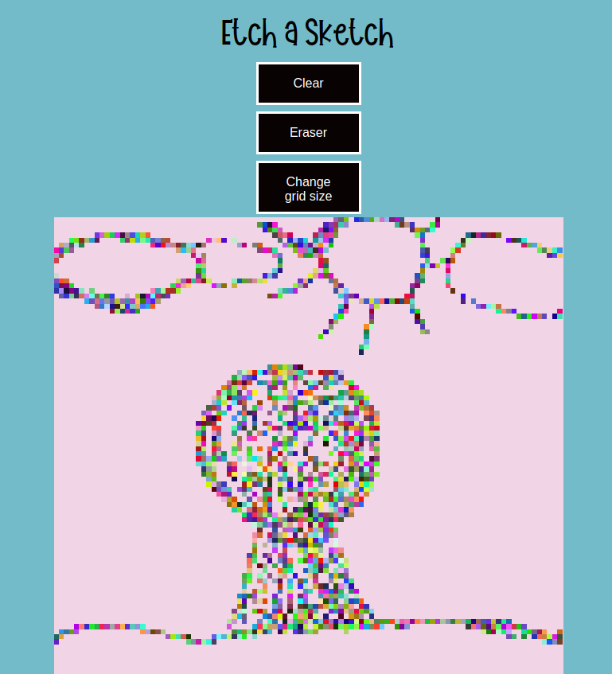

# Etch-a-Sketch by RoseCodez 2023

Simple Etch a Sketch game that allows player o draw and create drawing. The user is also able to change the grid size, and also to clear the grid.

`Introduction`
(The Odin Project - https://www.theodinproject.com/lessons/foundations-etch-a-sketch)
In this project, you’ll be creating a pretty neat toy for your portfolio to flex your DOM manipulation skills. You’re going to build a browser version of something between a sketchpad and an Etch-A-Sketch.

`Personal experience working on this project`
Since i created all the elements through DOM it was quite challenging (but that was also the point of this project as said in introduction). The elements created through it had difficulty to be reached and used in other functions. Because of that i had encountered a lot of `is not defined` in my code. So from that point I had 2 options: 1. I chould have taken a lot of time to rewrite the creation of elements in HTML or 2 (that i actually chose and did finally) redeclare some elements in different function scope for that function to actually be able to use it. That option saved me more time!

`Difficulties encountered`
I learned that I have to understand exactly the output I have to achieve through the project and `plan before`. This is something I must do before I actually start to code, since it will get me to go around in circles at some point.
Hardest part was understanding how the code behaves when I wanted to resize the grid (through clicking the `change grid size` button). I had to actually calculate the square size each time the grid was changing size.

`Future ideas to implement:`
Transform the behavior of a square when interacting with the mouse by introducing a series of modifications.

✔️ Rather than a simple color change from a color to another, each interaction should randomize the square’s RGB value entirely.

Additionally, implement a progressive darkening effect where each interaction adds 10% more black or color to the square. The objective is to achieve a completely black square only after ten interactions.

---
`Credits: `
Mangoes Slash Font - by AM Designs (https://www.fontspace.com/mangoes-slash-font-f82838)

